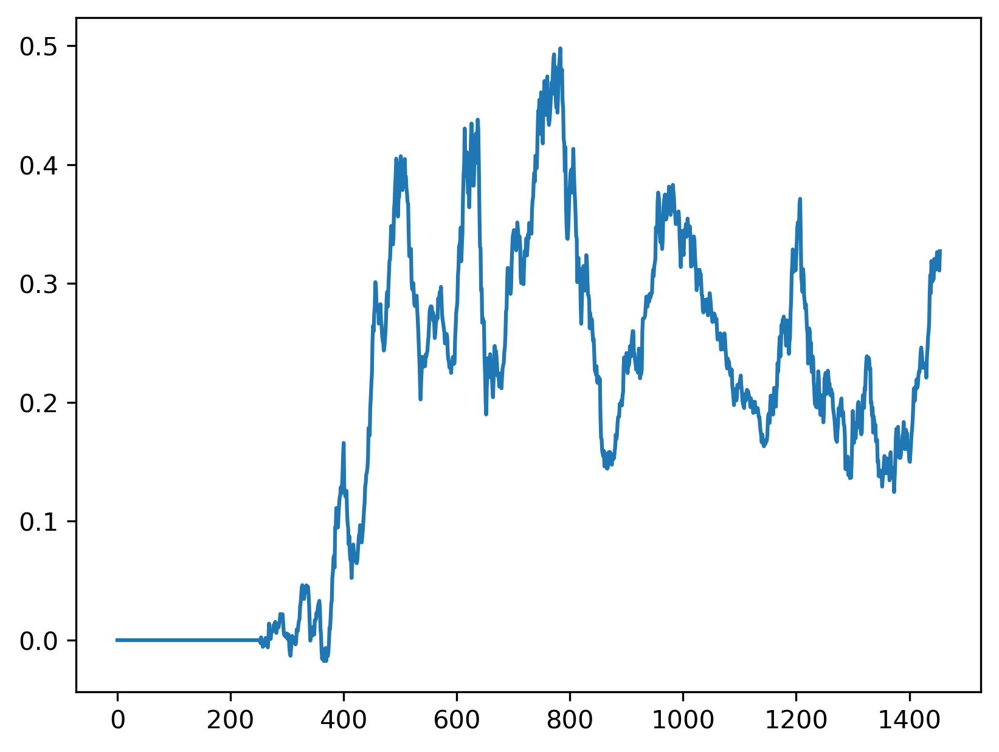
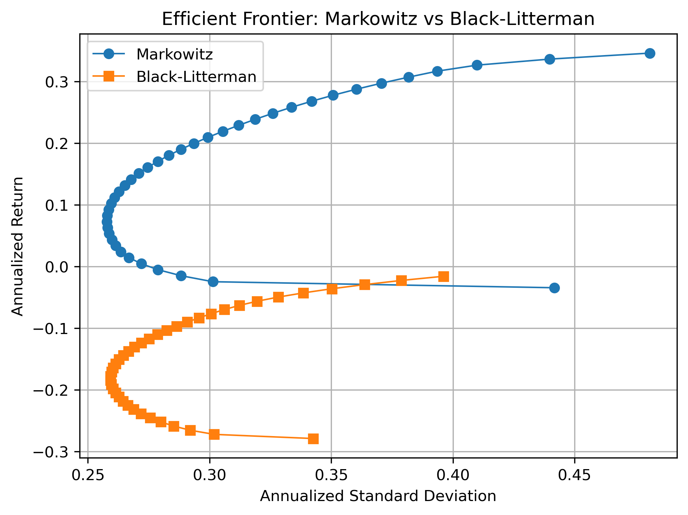

# 组合优化与 PCA 因子回测

基于中证 1000 小盘股池的“量化组合与因子回测”示例：先做 PCA 因子动量策略回测并产出收益与观点，再用 Markowitz 与 Black-Litterman 做组合优化。


## 项目结构

```
portfolio-optimization-factor-backtest/
├── notebooks/                    # 研究用 Jupyter 笔记本
│   ├── PCA_factor_backtest.ipynb           # PCA 因子策略回测（产出 results/）
│   └── Markowitz_BL_portfolio_optimization.ipynb  # Markowitz + BL 组合优化（依赖 results/）
├── src/
│   ├── __init__.py
│   └── calculateMaxDD.py        # 最大回撤与回撤持续期
├── data/
│   └── sample/                  # 示例数据（如 zhongzheng-1000.csv）
├── config/
│   └── tushare_token.txt        # Tushare Token（不提交，见 .gitignore）
├── results/                      # 回测与组合输出（由 notebook 生成）
│   ├── metrics_summary.csv      # 回测汇总指标
│   ├── cumRet.png               # 累积收益曲线
│   ├── dailyRet.csv             # 日收益率矩阵
│   ├── positions.csv            # 日频持仓表
│   ├── expRet.csv               # 预期收益表（供 BL 观点）
│   └── efficient_frontier_comparison.png  # Markowitz vs BL 有效前缘对比
├── README.md
└── LICENSE
```


## 方法概览

### 1. PCA 因子策略（回测）

- 滚动窗口（默认 252 日）内对日收益率做 **PCA**，得到公共因子。
- 用多输出回归得到每只股票在窗口内的**预测日均收益**，写入 `expRetTable`（导出为 `expRet.csv`）。
- 按预测收益排序：做多前 `topN`、做空后 `topN`，得到日频持仓并计算策略收益。
- 回测指标：年化收益、年化波动、夏普比、**最大回撤**、最大回撤持续期；并绘制累积收益曲线。

### 2. Markowitz 均值–方差

- 给定预期收益 **μ** 与协方差 **Σ**：
  - **GMV**：最小化 \(w^\top\Sigma w\)，约束 \(\sum w=1\)、\(w\ge0\)。
  - **有效前缘**：给定目标收益，最小化方差。
  - **最大夏普**：最大化 \((w^\top\mu - r_f)/\sqrt{w^\top\Sigma w}\)。

### 3. Black–Litterman

- 先验：市值加权得到 \(w_{mkt}\)，隐含均衡收益 \(\pi = \delta\Sigma w_{mkt}\)。
- **观点**：从 `results/expRet.csv` 取最后一行的日均预期收益，年化（×252）后作为 10 支股票的预期年回报率，即 **P = I**，**q** = 年化预期收益向量。
- 后验均值与协方差按标准 BL 公式计算，并绘制 BL 有效前缘；与 Markowitz 有效前缘画在同一张图中保存。


## 回测结果示例

### 累积收益曲线

策略净值（1+累积收益）随时间的走势由 PCA 回测笔记本生成并保存为 `results/cumRet.png`：



### 回测指标表

`results/metrics_summary.csv` 包含一行汇总指标，例如：

| 指标 | 说明 | 示例量级 |
|------|------|----------|
| Annualized Return | 年化收益率 | ~5.6% |
| Annualized Volatility | 年化波动率 | ~12% |
| Sharpe Ratio | 年化夏普比 | ~0.48 |
| Max Drawdown | 最大回撤 | ~24% |
| Max Drawdown Duration | 最大回撤持续天数 | ~671 日 |

（具体数值以你本地回测结果为准。）

### Markowitz vs Black–Litterman 有效前缘

组合优化笔记本将两条有效前缘画在同一张图中并保存为 `results/efficient_frontier_comparison.png`：




## 数据与配置说明

- **行情数据**：使用 `data/sample/` 下宽表（如 `zhongzheng-1000.csv`），列为 `trade_date` 与各股票代码，行为日期、值为收盘价。
- **结果目录**：`results/` 由笔记本自动创建并写入；若需版本管理，可将 `results/*.csv`、`results/*.png` 按需加入或排除于 Git。
- **Tushare**：仅 Markowitz/BL 笔记本中“用市值算 \(w_{mkt}\)”等步骤需要；Token 放在 `config/tushare_token.txt`，该文件已通过 `.gitignore` 排除，避免泄露。


## License

MIT License.
